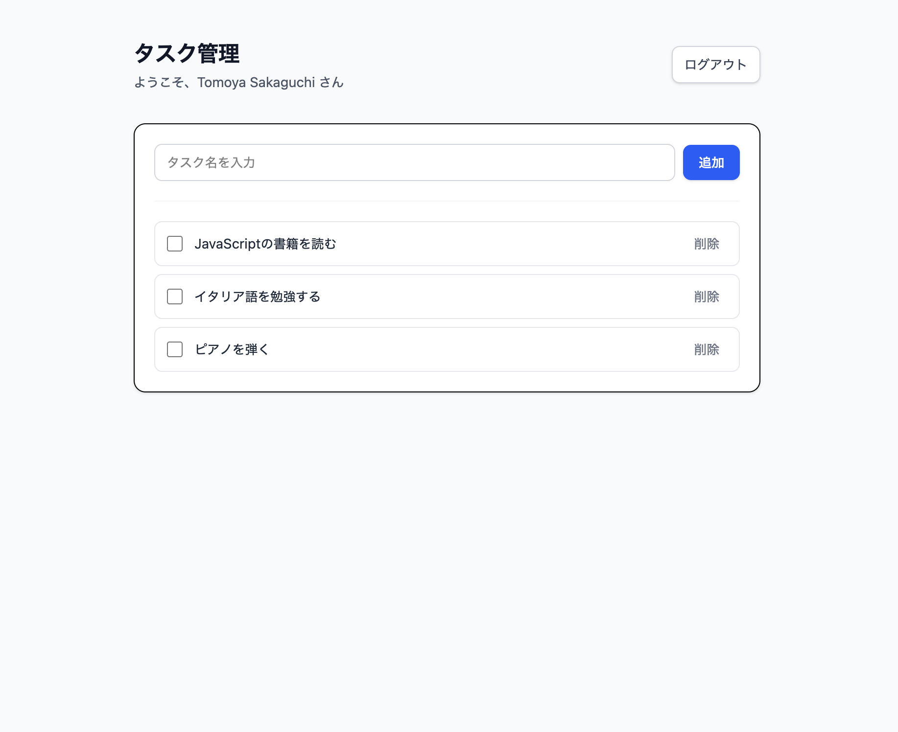

# React + TypeScript + Vite + Firebase Todo

## 概要
Firebase Authでログインし、ユーザーごとにFirestoreへタスクを管理。CRUD機能を実装。onSnapshotによるリアルタイム対応。

## 主要機能
- Google認証 (Firebase Auth)
- タスク追加/更新/削除 (Firestore)
- ユーザーごとのデータ分離 (`users/{uid}/tasks`)
- リアルタイム更新 (onSnapshot)
- 作成日時の表示（日本語形式）
- 作成順にタスクを並び替え

## 技術
- React 18 / TypeScript / Vite
- Firebase Auth / Firestore
- React Router

## 使用ライブラリ / ツール
- Tailwind CSS（スタイリング）
- ESLint / Prettier（コード整形・静的解析）
- Git / GitHub（バージョン管理）

## セットアップ
```bash
npm i
cp .env.local.example .env.local  # 環境変数を設定
npm run dev

## 学び・工夫
- onSnapshot を使いリアルタイム更新を実装
- useEffect cleanup で購読解除しメモリリークを防止
- Firestore セキュリティルールで uid によるデータ分離を実現
- ESLint/Prettier を導入し、チーム開発を意識したコード品質維持
- Firebase Hosting を使って CI/CD を体験
- Date.now() を利用して作成日時を保存し、toLocaleString("ja-JP") で日本語表示を実装
- orderBy("createdAt", "asc") を利用して作成順にタスクを並び替え

## 必要な環境変数(.env.local)
VITE_FIREBASE_API_KEY=（FirebaseプロジェクトのAPIキー）
VITE_FIREBASE_AUTH_DOMAIN=（例: your-app.firebaseapp.com）
VITE_FIREBASE_PROJECT_ID=（FirebaseプロジェクトID）
VITE_FIREBASE_STORAGE_BUCKET=（例: your-app.appspot.com）
VITE_FIREBASE_MESSAGING_SENDER_ID=（数値ID）
VITE_FIREBASE_APP_ID=（FirebaseアプリID）

## 画面



## 使い方
1. Google アカウントでログイン
2. タスクを入力して追加
3. チェックボックスで完了状態を切り替え
4. 不要なタスクは削除

## プロジェクト構成
src/
  components/   # UI コンポーネント
  pages/        # 画面単位
  types/        # 型定義
  firebase.ts   # Firebase 初期化

## デプロイ
https://react-ts-firebase-todo-d5d7f.web.app

## リポジトリ
https://github.com/Tom198602/my-todo-react-firebase


