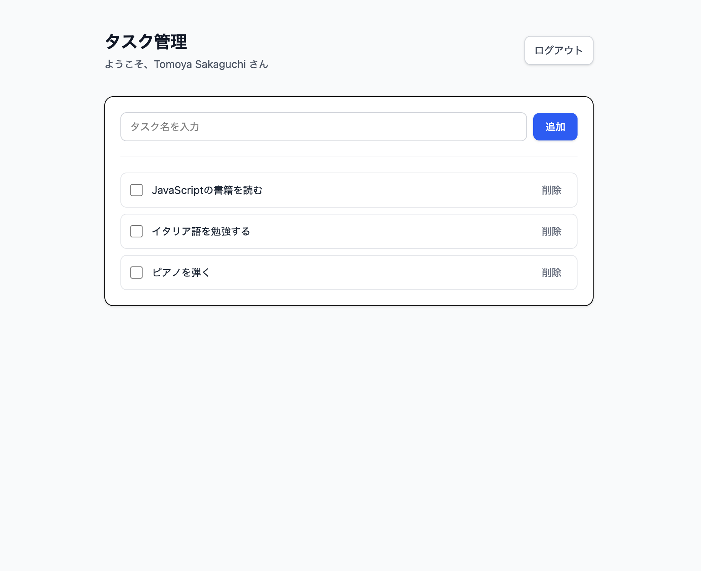

# TaskFlow - React + TypeScript + Firebase Todo

Firebase Auth と Cloud Firestore を使ったリアルタイム Todo アプリです。Google ログイン後、ユーザーごとに分離されたタスクを追加、編集、完了、削除できます。

[Live Demo](https://react-ts-firebase-todo-d5d7f.web.app)

## Portfolio Highlights

- React 19 + TypeScript + Vite によるコンポーネント設計
- Firebase Auth の Google ログイン
- `users/{uid}/tasks` によるユーザー単位の Firestore データ分離
- `onSnapshot` を使ったリアルタイム同期
- タスクの追加、インライン編集、完了切り替え、削除、一括削除
- 未完了/完了フィルター、件数、完了率の表示
- ローディング、空状態、エラー、送信中などの UI 状態
- Firestore Security Rules による認証済みユーザーのアクセス制限
- レスポンシブな Tailwind CSS UI

## Tech Stack

- React 19
- TypeScript
- Vite
- React Router
- Firebase Auth
- Cloud Firestore
- Tailwind CSS
- ESLint

## Getting Started

```bash
npm install
cp .env.local.example .env.local
npm run dev
```

`.env.local` に Firebase プロジェクトの値を設定してください。

```bash
VITE_FIREBASE_API_KEY=your-api-key
VITE_FIREBASE_AUTH_DOMAIN=your-project.firebaseapp.com
VITE_FIREBASE_PROJECT_ID=your-project-id
VITE_FIREBASE_STORAGE_BUCKET=your-project.appspot.com
VITE_FIREBASE_MESSAGING_SENDER_ID=1234567890
VITE_FIREBASE_APP_ID=1:1234567890:web:abcdef123456
```

## Available Scripts

```bash
npm run dev
npm run lint
npm run build
npm run preview
```

## Firestore Structure

```text
users/{uid}/tasks/{taskId}
  title: string
  done: boolean
  createdAt: number
  updatedAt: number
```

## Security Rules

`firestore.rules` では、ログインユーザーが自分の `users/{uid}/tasks` だけを読み書きできるように制限しています。タスクの文字数、boolean 型、日時フィールドも検証します。

## Screenshots




## Project Structure

```text
src/
  components/   UI components such as TaskForm, TaskList, TaskItem
  hooks/        Firebase task logic separated from UI
  pages/        Route-level screens
  types/        Shared TypeScript types
  firebase.ts   Firebase initialization and env validation
firestore.rules Firestore access rules
```

## Code Walkthrough

- `src/firebase.ts`: Firebase の初期化と環境変数チェック
- `src/App.tsx`: ログイン状態によるルーティング
- `src/hooks/useTasks.ts`: Firestore の購読、更新、削除をまとめたカスタム Hook
- `src/components/TaskForm.tsx`: 新しいタスクの追加フォーム
- `src/components/TaskList.tsx`: フィルター、件数、完了率、一覧の表示
- `src/components/TaskItem.tsx`: 1件分のタスク表示とインライン編集

## What I Focused On

このアプリは小さな Todo アプリですが、採用担当者が見やすいように「実務で必要な状態管理」を入れています。Firebase との通信は `useTasks` にまとめ、画面表示は小さなコンポーネントに分けることで、処理の流れを説明しやすい構成にしています。
